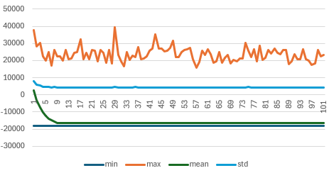

# PWr : Optimization Methods Theory and Applications - Project

## A. Problem

The goal here is to implement an algorithm to help tourists visit a city. Given a list of places to visit and some contraints we want to provide the optimal tour in the city while satisfying the constraints.

We gather a list of places to visit in the city, the overall grade of these places according to websites like Google Maps or Trip Advisor, and the total number of reviews. We also want to categorize these places in 4 categories : 
- Attractions
- Cafes
- Restaurants
- Bar 

We then collect a list of constraints from the user, like when and where to start the tour, if he wants to eat lunch at a restaurant or go to the bar at the end of the tour.

The main issue with this problem will first be to find a solution that satisfies the constraints.

### A.1. Modeling

#### A.1.1. Problem

The problem is a list of places, a matrix of time to travel between each place, and constraints.

##### Places

Each place contains the following attributes :
- id
- name
- grade and number of reviews
- average time to visit
- open and close hours
- average price
- location

##### Travel Time Matrix

To simplify the problem here it's only the time to travel between each location on a straight line at average walking speed.
But for future implementation this matrix is intended to be fetched from mapping services like Google Maps.

##### Constraints

Here are a list of constraints the user can set :
- start location
- end location
- start time
- total duration
- breakfast, lunch, dinner, bar
  - window (when does he want to eat)
  - duration (how long does he want to spend eating)

**Example**

```
start: Main train station
end: not specified
start time: 7 am
total duration: 15 hours (07h - 22h)
breakfast: no
lunch: yes between 12h and 14h for 1h
dinner: no
bar: yes after 20h
```

#### A.1.2. Solution

A solution is an ordered list of places.
Given this list and to get the detailed tour information (when to be at each place) we use the following algorithm :

```js
t = constraints.startTime
for (place in tour) {
  // Take the time to travel to the place
  // If it's the first place we consider previous_place to be the start location constraint
  t += time_to_travel_from_previous_place
  
  // Check if it's the breakfast
  if (constraints.breakfast && place.type == cafe && !breakfastDone) {
    if (t < place.open) {
      // Wait for the opening of the place
      t = place.open
    }

    // ... Perform some action on this place

    // Spend time on breakfast
    t += constraints.breakfastDuration
    
    breakfastDone = true

    // Go to next place
    continue
  }
  // Idem for lunch (type = restaurant), dinner (type = restaurant) and bar
  else if // ....

  // Just an attraction
  else {
    if (t < place.open) {
      // Wait for the opening of the place
      t = place.open
    }

    // ... Perform some action on this place

    // Visit the place
    t += place.timeToVisit

    // Go to next place
    continue
  }

}
```

We use a simple list to keep track of the tour rather than keeping more detailed informations (eg. when should we be at a specific place or if it's the place to take lunch) to simplify operations on the tour (ie. crossover and mutation operators can be simple swaps on the list).
The main issue with this approach is that the solution encoding allows non-compliant solutions.

##### Compliancy

A solution is compliant if it meets the following requirements :
- compliant with the user defined constraints
- tour contains no duplicates
- places are open when visiting them

##### Repair

We can repair a solution if it's not compliant. The repair process is quite the same than the random generation (more on that later, but the *random* solution is almost compliant), except that instead of using shuffled list of places from the problem we try to use the places from the solution, and fallback to the problem places.

> For instance if the solution has a cafe too late and no restaurant the repaired solution will include the cafe at the good time and a random restaurant from the problem.

Notes :
- This method discards the attractions that are too late.
- Before performing the repair we remove the duplicates from the solution.

### A.2. Fitness

1. Get compliancy of the solution
2. Compute penalty and fitness
3. Get weighted sum of penalty and fitness

#### Step 1 : Compliancy

For each constraints (user and others) we check if the solution is compliant, and for time constraints we get the distance with the constraint. For instance, if the constraints is the lunch before 14h but the lunch ends at 14h15 this constraint will have a value of `-15`.
It's possible in the configuration to allow bonuses (ie. positive distances for time constraints)

#### Step 2 : Penalty

Boolean constraints get a flat penalty and distances get weighted. We then sum those penalties.

#### Configuration

It is possible to tweak the settings of the fitness computation in a `.json` file. You can find an example in `config/default.json`.

### A.3. Generation

We can generate random test cases to test the optimizers against different problem instances. Those test cases are generated using a different executable and saved in a folder to be used as an input for the optimizers. By doing that we can be sure that the optimizers are compared on a same instance of the problem.

The generation process take the following options :
- city size
- number of places
- number of problems to generate

> The city size corresponds to the range in meters in wich a place can be located. So each generated places can be located in a square of size city_size.

## B. Optimization

### B.1. Random

To generate a random solution we use a similar approach than the algorithm used to get informations on the tour.
Using this approach we can generate solution almost compliant regarding :
- user defined constraints : start location, eating, tour duration
- tour contains no duplicates
But some constraints can be broken :
- places are open when visiting them

### B.2. Simple GA

Due to lack of time only a simple point crossover and a swap mutation were implemented.

#### Iteration

We perform selection and crossover until the population size is reached.
Then for each solution we repair it if its not compliant.

## C. Results

For the following tests we will use the same 10 instances. These 10 randomly generated instances have the following parameters :
- City size : `5000` (5 km²)
- Number of places : `100`

The GA runs will use the same parameters :
- Population size : `10 000`
- Generations : `100`
- Crossover probability : `0.4`
- Mutation probability : `0.1`

### Random search

As stated before, random generated solutions are almost compliant, and given a big enough population size some compliant solutions can be found. To be able to compare this strategy with GA strategies the same number of iterations were done. So if the GA is given a population size of $x$ and $y$ generations we compare it with a random population size of $x*y$.

### GA without repair

In this version we don't apply the repair function to the solution but instead perform the following checks :
- If the solution is 100% compliant : *keep it*
- If solution's total duration $<$ user constraints + 2h : *keep it*
- Else : *regenerate a new random solution*

During testing, no 100% compliant solution where found, but near compliant solutions exists, often they are not compliant because some eat end limit constraints (eg. lunch limit time) are late by less than 1h.

Moreover, after crossover almost all solution are broken, to overcome that we use the second check. The main issue found after crossover is that the number of places in a solution tour increase over time. To prevent solutions with absurd number of places, we check the total duration of the solution and discard it if this number is too far from the user's constraint. Doing that we can keep a bit of diversity in the population while discarding very bad solutions.

However this strategy didn't succeed in providing good solutions, and the overall fitness of the population drops dramatically after a few generations.

### GA with repair

To try to overcome this issue a repair function was introduced. As stated before it works a bit like the random solution generation, but use in prority the places and order of the provided solution. This function allows near compliant solutions like the random generation.

Here is an example of a run on one instance of the problem. We can see that the overall fitness doesn't improve over generations.


### Comparison of strategies

Sadly neither GA versions succeeded in providing better solutions than the random search.

Here is the **best solution** found on the example run above compared to the random search on the same problem instance and with the same amount of iterations ($10,000*100$ for GA and $1,000,000$ for random search).

| Optimizer | Raw Fitness | Penalty | Weighted Sum |
| - | - | - | - |
| Random | `69604` | `-5212` | `43539` |
| GA | `66007` | `-5329` | `39362` |

> For the GA optimizer the best solution is taken from the whole run, not the last generation only. And if most of cases this best solution is found in the firsts generations.

> Average fitness of the population of the random search for this run : `2683`

The results above are for one specific run on one specific problem instance. Here are the max min and average fitness of the **best found solution** across 5 runs on this same problem instance.
|  | Random | GA with repair |
| - | - | - |
| **Raw Fitness** |
| Max | `71741` | `66837` |
| Average | `70205` | `64364` |
| Min | `69293` | `61897` |
| **Penalty** |
| Max | `-5107` | `-5235` |
| Average | `-5218` | `-5301` |
| Min | `-5303` | `-5329` |
| **Weighted Sum** |
| Max | `45226` | `40232` |
| Average | `44112` | `37859` |
| Min | `43255` | `35422` |

## D. Discussion

First of all, the main issue that I faced during this project is learning C++.
For the starting project I choose Python to be able to focus more on how Genetic Algorithms works and not how to implement them. But given the poor performances I got, mainly due to each run taking a lot of time, I decided to implement the main project with C++.
This was a challenge for me because allong with designing how to model the problem and generate solutions, I had to learn C++. This was a great experience for me because I learned of lot of things and was able to get faster run speed, but I lost a lot of time on the implementation and sadly I wasn't able to reach all my goals for this project. So if I was given more time to implement this project here are the different things I would try :
- Mutli-objective optimizer
- Linkage learning methods
- More metaeuristic methods

To improve the results of the GA here are some things that could be tested :
- Crossover that don't break too much the solution, for instance only swapping places of the same type
- Same thing for the mutation
- Try some other repair methods
